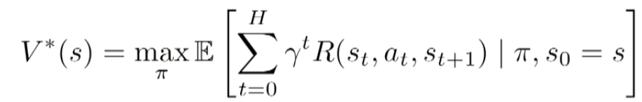
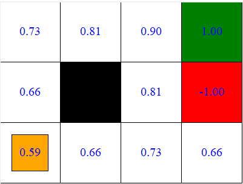
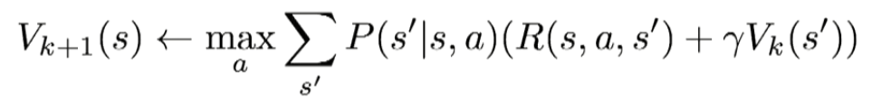
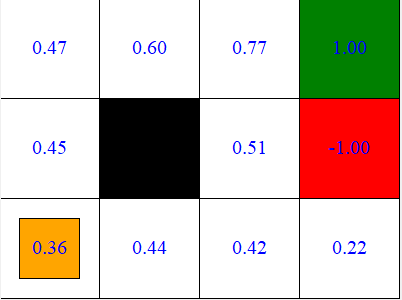
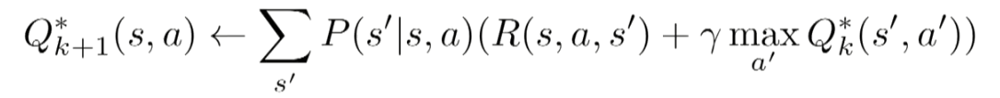
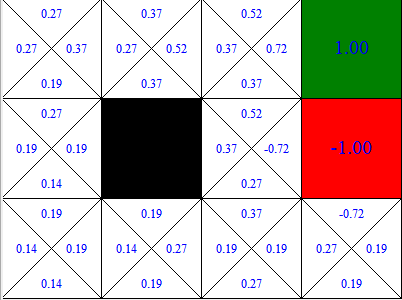

# Reinforcement Learning algorithm simulation with Grid world

## Optimal value function

find the optimal value for each grid cell

### Deterministic 

### Stochastic 

## Q value iteration

Here we save the the value for each  state action pair.
Which is defining how good an action is by taking the action and how much we can get from the state we land in.
  
